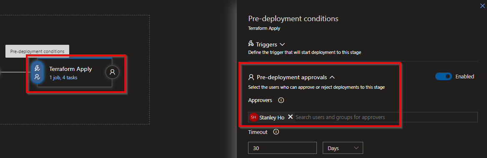

## Introduction
With more and more businesses utilising Cloud platforms such as Azure, AWS or GCP and deploying their infrastructure to the cloud, it has become important to find ways to automate the deployment process of this. The benefits of automating deployment of IaC and IaC itself are:
* **Diaster recovery** - Having your infrastructure all coded out and automated allows you to redeploy your infrastructure in a few minutes. It also allows you to rollback changes to a working state if any new changes break your infrastructure.
* **Auditing** - Utilising IaC you can use branching policies and pull requests in your code repo to review any changes that are going to be made to the infrastructure (more on this later). Meaning you have an audit trail of the changes that have been made.
* **Security** - You can increase security by reducing permissions that people have in the Cloud Portal so that no deployments can be done via the portal and only via IaC.
* **Productivity/Efficiency** - By having your infrastructure as code you can deploy multiple environments e.g. for development, QA, production. This would take minutes, rather than hours when trying to deploy it via the portal. Saving time for engineers to spend time doing other tasks.
* **Documentation** - The IaC is your documentation for your infrastructure so if an engineer leaves, the infrastructure that is required is already documented and procedures to deploy and change it should be in place.

This blog will inform you how to deploy your Terraform scripts using Azure DevOps pipelines. Bearing in mind I have wrote this thinking you know about Terraform and have some understanding of Azure DevOps

## How to Automate deploying Infrastructure
By using the tool Terraform and CI/CD pipelines provided by Azure DevOps, we can build, change and version infrastructure both safely and efficiently. The first job is the map out your infrastructure and convert it into code by using Terraform. Terraform provides very good documentation on how to map out your resources into Terraform scripts, which can be found here. If you use certain cloud platforms here are some Terraform documentation below:
* [Azure](https://registry.terraform.io/providers/hashicorp/azurerm/latest/docs)
* [AWS](https://registry.terraform.io/providers/hashicorp/aws/latest/docs)
* [Google Cloud Platform](https://registry.terraform.io/providers/hashicorp/google/latest/docs)
Once you have your infrastructure beautifully coded into Terraform you can start configuring your pipelines. In Azure DevOps you should set up your pipelines

## Build Pipeline
The reason why we have a build pipeline is are for a number of reasons:
1. To check your code is valid before you can commit it to the master branch e.g. very useful once branch policies are set up for Pull requests
2. So that you can check the what changes will be made to the infrastructure if you deploy the Terraform scripts. As you can see from the example below one of the build steps is a "Terraform Plan" step which will show us the changes that will be made to the infrastructre, here it will create an Azure Kubernetes cluster. Terraform Plan is nicely formatted at the build pipeline with symbols with "+ = create", "- = destroy" and "~ = changes".

The following steps should be added to your Build Pipelines
Note:
* This uses the Azure DevOps Terraform Plugin which can be found [here](https://marketplace.visualstudio.com/items?itemName=charleszipp.azure-pipelines-tasks-terraform)

* **Terraform Install** - This step installs Terraform and the version which you dictate onto the build agent
* **Terraform Init** - This step initialises Terraform on the build agent and also creates a .tfstate file that will house the state of the infrastructure e.g. what is deployed. You can choose where to create this .tfstate file, I recommend storing it in a storage account within the Azure Subscription you are deploying too.
* **Terraform Validate** - This step validates that the syntax of your code is correct
* **Terraform Plan** - This steps will compare the code in your Terraform files to the infrastructure that is deployed (dictated in the .tfstate file more info here) and output the changes it will do. It is also here you add in the variables you are injecting into the Terraform scripts, make sure to utilise the Azure DevOps Library Sets.
* **Delete files from Terraform** - This is just used to delete any Terraform modules in your ./Terraform folder. This step is Optional
* **Publish Artifact** - This basically will create an artifact that contains your Terraform files in your repository, which will be then used in the release pipeline

## Release Pipeline
The release pipeline has two stages **Terraform Plan Stage** and **Terraform Apply Stage** both have the same steps, but the **Terraform Apply Stage** has the additional step which will tell Terraform to apply the plan to the infrastructure. The reason why it is set up like this are:
* To check that your code is valid. Although we did this at the build step it's always good to double check
* You can add a pre-approval gate before Terraform deploys the infrastructure changes. This is a good gate to have to ensure that the appropriate people can approve deployment changes, this adds security and responsibility as well as auditing

### Terraform Plan Stage

### Terraform Apply Stage

As you can see these are similar steps to those used in the Build Pipeline with the new step called **Terraform Apply** which will deploy the changes that it dectects from the .tfstate file and your Terraform files.

## Making Changes to Infrastructure 
It is here I recommend adding branching policies which will enforce people to use Pull requests before merging into the branch you are using in your build pipeline e.g. "Master" branch. Setting it up like this allows for the build pipeline to run and pass before it is even allowed to be approved to be merged into the Master branch. Below is a Branching policy I added to the Master branch, which requires that pull requests is approved by 2 approvers, but also passes the Build pipeline we set up earlier. By doing this you can see the code works, more importantly you see the **Terraform Plan** and what changes would be deployed which is helpful to see for the approvers. You can see below the branch policy and the build validation being set for the Master Branch

Make sure that if you do this, that your release pipeline is set to build off artifacts made by the Master branch only. Otherwise if it triggers on the latest build the build that is produced by the pull request will be used.

Once these are set you can set triggers to allow for continuous integration on your build pipeline and release pipeline. Adding these means that the build pipeline will run everytime there is a new commit to your Master branch (note that adding the build validation to your master branch will automatically create a build everytime there is a new Pull request) and a new release deployment will be created with every successful build artifact created. Be sure add a pre-deployment approval gate to your **Terraform Apply stage**, which will allow you to control Terraform deployment changes to your infrastructure.

