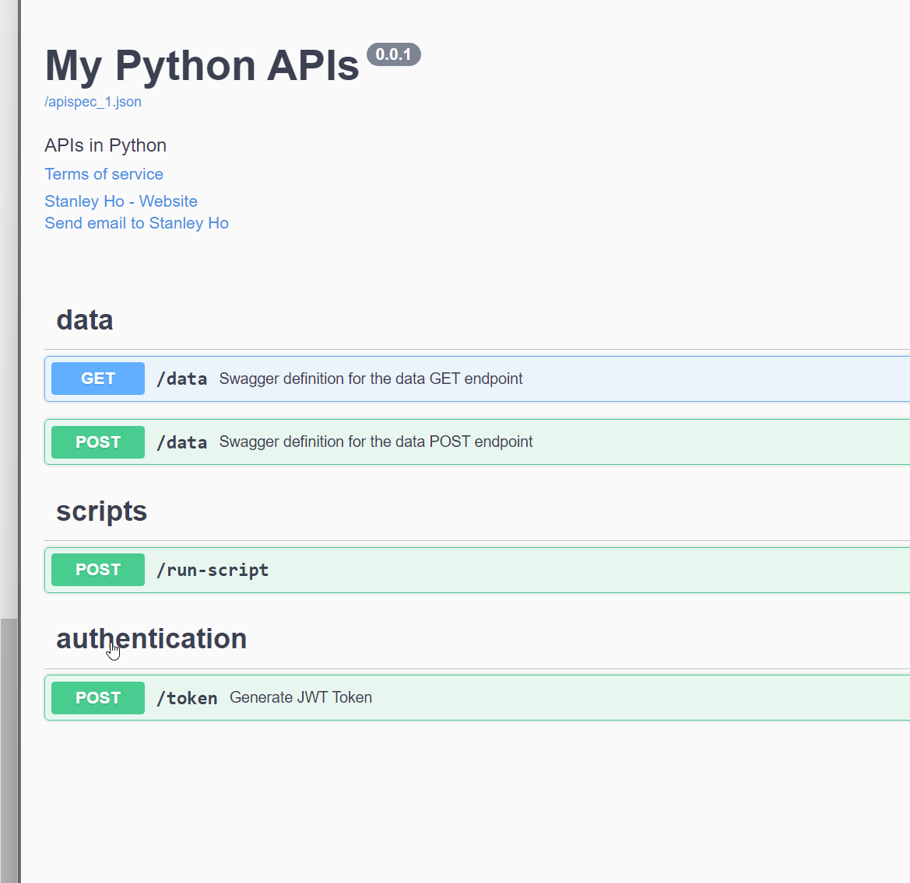
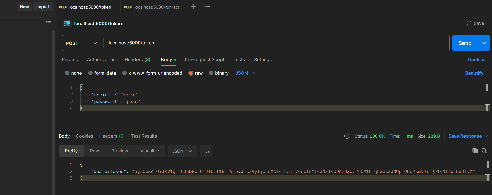
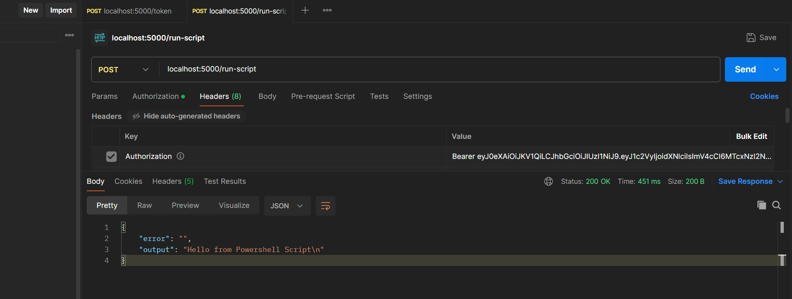

## Introduction
As usual, I found myself bored on a Friday night (maybe I should get out more, huh🤔 - but being in my late 20s i'm not built for that life anymore), so I decided to challenge myself by coding a "simple" Python API. I thought it would be a useful skill to have, especially if I ever need it in my work as a DevOps Engineer.

A small disclaimer: I lack extensive coding experience, which is why I mention the 2 hour time it took in the title (not sure if 2 hours is good or not...). Anyway, this resulted in a simple API without a fancy database backend or complex logic. The last time I did any serious coding was back in 2018 when I used Java to create an Android application for tracking people's phone usage (this was before Apple and Google implemented similar features on their phones!). While I can read and quickly pick up new programming languages, knowing which functions, methods, and tools to use is another story.

This is where ChatGPT comes into play, my saviour and teacher. Since I spent £20 on a monthly subscription for personal use, I figured I might as well make the most of it😭. 

## The Idea
The outcome of this is:
- Python application with a few API endpoints
- Swagger API documentation - Purely because I've never had the chance to create one
- Have some sort of authorisation on the API - via BearerToken
- Hope ChatGPT can carry me in this task🤞
- Run the application on Docker so I can just run the image locally and test the API works and also check the Swagger page generated for it

By challenging myself with this project, I aim to gain a better understanding of Python, API development, and how to efficiently utilise ChatGPT for such tasks. These skills will hopefully help me advance in my DevOps career in the future.

## The Outcome
The repository containing the files of this project can be found in this [repository](https://github.com/TheStanHo/WeekendPythonApi). With the file structure below.
```
.
└── Python-API
    ├── Swagger
    │   ├── data_get.yaml
    │   ├── data_post.yaml
    │   ├── login.yaml
    │   └── run_script.yaml
    ├── app.py
    ├── DockerFile
    ├── requirements.txt
    └── script.ps1
```
Please note: Security was not the forefront of my mind for this implementation. For example, the username and password are hardcoded for the /token endpoint. In a production environment, I would validate the username and password against a database before generating a JWT token.

I managed to create 4 api endpoints 
1. **/data - GET** - This just returns a string to say "Hey please use the POST method for this endpoint" - Pointless but I just wanted to try creating a simple GET endpoint and as you can imagine... I'm not the creative type. 
2. **/data - POST** - This would just return the json body that was sent to the endpoint. But you could see how this could be used to say send data and persist it to some kind of database or send it to an application for further processing for example.
3. **/token - POST** - This would generate a JWT token, if the correct username and password is used. Then it will respond back with a JWT token which you can use on the /run-script endpoint. Useful in future to restrict endpoint request to certain users
4. **/run-script - POST** - This will run a pre-created Powershell script given the correct bearer token and return back the output of the powershell script.

The Swagger created for the endpoints can be seen below


And some examples of the endpoints can be seen below


And some examples of the endpoints can be seen below

## Conclusion
I would say I managed to accomplish what I set out to do. Am I a Python expert? By no means. But do I have a better understanding of how to create an API using Python? Absolutely.

The things I've learned from this:
- **Decorators in Python**: Understanding how to use and implement decorators to add functionality to functions.
- **Flasgger for Swagger Documentation**: Using Flasgger to create comprehensive and interactive API documentation.
- **Running Scripts in a Python App**: Learning how to execute scripts within a Python application.
- **Importance of a requirements.txt File**: Realizing the utility of a `requirements.txt` file for managing dependencies.
- **Creation of JWT Tokens**: Gaining knowledge on how to generate and use JWT tokens for authentication.

I've also learned how ChatGPT can assist with this process (I used the ChatGPT-4 model for this project). While the code it generates is not always perfect, my background in Object-Oriented Programming from university helped me read, debug, and understand the logic behind it. This experience has given me some potential applications for my work, which I am grateful for.

I might build upon this project in the future such as:
- **Secure Storage of secrets** - It's probably not the best idea to house the secret key used for encoding and decoding the token in a Dockerfile 🙄, but this was just a quick win for now. 
- **Better Credential checking** - As mentioned earlier I would implement a more secure method for checking credentials, such as querying a user database.
- **Error Handling** - Enhance the error handling to handle more edge cases.
- **Security Best Practices** -  Implement additional security measures, such as rate limiting and input validation, to reduce the risk of attacks on API endpoints.

But knowing me, I'll probably get distracted by something else. Till the next random idea 🫡