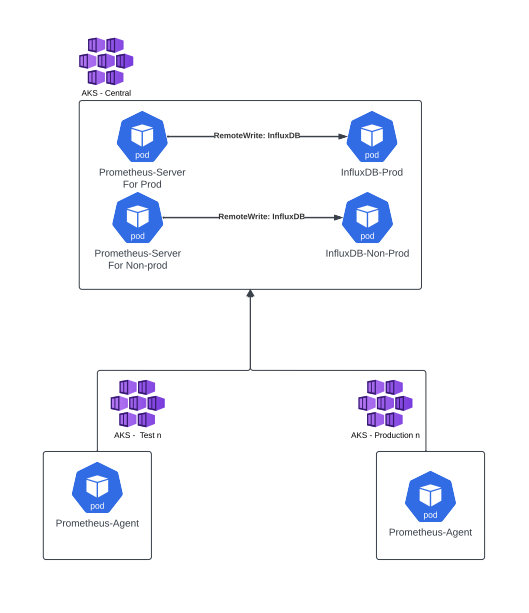

Each of us manages multiple AKS clusters across various environments, and we want Prometheus to monitor them. One of the challenges we face is effectively monitoring environments with multiple clusters, which can be the case in certain test or production environments(hopefully).

 Though there are solutions such as:
 * Prometheus Federation
 * Thanos (Not the Marvel one!)

The simplest option I came across is the Prometheus agent introduced in Prometheus version 2.32.0. The agent mode deactivates certain features typically present in the Prometheus server, focusing solely on discovery, scraping, and remote write functions. This design choice is aimed at enhancing the performance of the Prometheus agent.

## Overview of the set up
In my opinion and experience the best way to implement this is shown in the diagram below. 



In this model we will have: 
- 2 Instances of Prometheus Server -> One for Production and another for Non-production. You can run this on the same AKS or separate it if you want to split your non-prod and prod metrics.
- 2 Instances of InfluxDB -> One for Production Prometheus server to remote write to and another for Non-production prometheus instance to remote write to. (Note that you are not restricted to InfluxDB and there are other options to use as Remote Endpoints and storage which can be found [here](https://prometheus.io/docs/operating/integrations/#remote-endpoints-and-storage)). Again you can run this on the same AKS or separate it if you want to split your non-prod and prod metrics.
- Multiple Prometheus agents that are set up in different environments to remoteWrite to our Prometheus Servers respectively.

## Implementation
In this scenario we will already have set up an InfluxDB for Prometheus Server to write to. You can use this [InfluxDB Helmchart](https://artifacthub.io/packages/helm/influxdata/influxdb), if you want to implement using InfluxDB as your remote endpoint and storage or use an alernative solution as mentioned in the previous section.
- [Prometheus Helmchart](https://artifacthub.io/packages/helm/prometheus-community/prometheus)

### Prometheus Server configuration values
The below configuration does the following:
- The [web.enable-remote-write-receiver](https://prometheus.io/docs/prometheus/latest/feature_flags/#remote-write-receiver) enables the the /api/v1/write endpoint on the Prometheus Server
- Ingress is set up so that the Prometheus agent has a nice url to write to
- RemoteWrite and RemoteRead so that Prometheus server knows where to write and read too. Allowing us to retain data even with Prometheus restart. One thing to note is that if the Prometheus server cannot write to InfluxDB it will write and read data locally to/from the pod itself, the default retention is set to 15 days. So you will only get data for 15 days until the issue with writing to InfluxDB is resolved. 

```yaml
server:
  extraFlags:
    - web.enable-remote-write-receiver
  ingress:
    enabled: true
    tls:
      - secretName: tls #secretName holding the TLS certificate information
        hosts:
          - prometheus-server.<domain>
    hosts:
      - prometheus-server.<domain>
    annotations:
      kubernetes.io/ingress.class: "nginx"
  remoteWrite:
    - url: "https://influxdb-prod.<domain>/api/v1/prom/write?db=prodPrometheus"
  remoteRead:
    - url: "https://influxdb-prod.<domain>/api/v1/prom/read?db=prodPrometheus"
```

### Prometheus Agent configuration
Note that I have found since we use defaultFlagsOverride to set this, we will need to put in additional arguments since you are overriding the default arguments that the Prometheus containers start up with. 
- The [enable-feature=agent](https://prometheus.io/docs/prometheus/latest/feature_flags/#prometheus-agent) puts the Prometheus-server into agent mode 
- The config.file is where the prometheus.yaml file is located
- The [web.enable-lifecycle](https://prometheus.io/docs/prometheus/latest/migration/#prometheus-lifecycle) allows HTTP Post request to be sent to the /-/reload endpoint so that it will reload any configmap/config when it is updated
- The remoteWrite is set to the Prometheus Server endpoint so that it can write data to that server
- The external_labels is used to add labels to the metric data that the Prometheus agent sends to the Prometheus server. Note that if you alreaedy have metrics any old data already written to storage will not have any external_labels appended to it, only new data.

```yaml
server:
  global:
    external_labels:
      clustername: "Test01"
      environment: "Test"
  defaultFlagsOverride:
    - --enable-feature=agent
    - --config.file=/etc/config/prometheus.yaml
    - --web.enable-lifecycle
  remoteWrite:
    - url: "https://prometheus-server.<domain>/api/v1/write"
```

## Conclusion
In my opinion utilising the Prometheus agent is the simplests way to monitor multiple clusters and send the data to a centralised server for use to query. The information in this blog should help point you in the right direction to set this up or at least let you think on how to implement this. A more detailed blog regarding Prometheus agent in general can be found [here](https://prometheus.io/blog/2021/11/16/agent/).