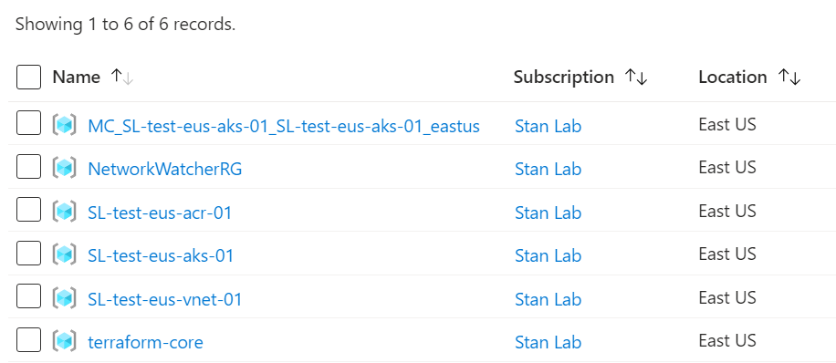
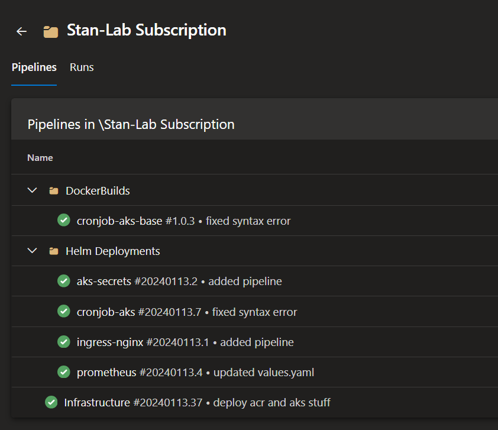

## The Idea
Having been bored over the weekend, as you do of course. I thought I'd spend some time setting up my personal Azure Subscription alongside some basic infrastructure, so that in the future I can have a personal Sandbox in Azure where I can Test and refresh my knowledge of technologies. It would also be usefeul to have for when I learn for some Azure Certifications in the future (so he says).

This would also actually gave me a chance to reinforce technologies that I already know or haven't used in a while. 

## Technology used
- Cloud Provider - Had to be Azure of course, mainly because it has been the only cloud provider I have used and one I use for work. I signed up for their [Free account](https://azure.microsoft.com/en-gb/free/). Since they offer $200 free Azure credit it would allow me to see how much money my sandbox environment would actually use, if I decided to upgrade to Pay-As-You-Go in future. (This is where in future I will regret and accidently rack up a bill of 10k). With Azure Pricing calulator though, I have estimated it should cost me no more than around £60 ~ a month if I was on Pay-As-You-Go. Deployng to East US seemed to be the cheapest option.
- Infrastructure as Code - I knew to help reduce costs so that I can quickly spin up and down the Sandbox environment I would need to utilise some IaC. It would also allow me to assign some roles to the service principal and managed identities so that when I spin the environment up from scratch I would have less to think about. 
- CI/CD - For this the obvious choice was Azure DevOps. It also gave me more of a chance to test out what I have learned about Azure Yaml pipelines. 

### A Scenario - The beauty of a simple task
So I gave myself a task to come up with some useful cronjob. The Cronjob's purpose I decided was for it to scale down all my deployments at a given time. The beauty of what sounds like a simple task is that it allows me to play with different technologies and reinforce my skillset. For example to do this I used: 
- Powershell - Used to script the scale down of the deployments which the cronjob ran. You can see this below
```
    #Get all the deployments from the default namespace
    $deployments = kubectl get deployments -o jsonpath='{.items[*].metadata.name}'
    
    #Convert the output string into an array
    $deploymentArray = $deployments.Split(" ")

    #Scaling down each deployment
    foreach($deployment in $deploymentArray){
      Write-Output "Scalingdown deployment: $deployment"
      kubectl scale --replicas=0 deployments/$deployment
    }

    Write-Output "Scaling down operation completed successfully"
```
- Docker - Creating a Docker image allowed me to create the cronjob with the correct "environment" for it to run the script. 
- Azure Container Registry (ACR) - This was used to house my custom docker image which was deployed via Terraform
- Helmcharts - Allowed me to deploy the cronjob, aks secrets housing the secret I required to pull from my private ACR.
- AKS roles, rolebindings, service accounts - Never had to actually create these myself since these are usually created for you on the Helmcharts you get from say Artifact hub. So it was nice to learn something new to me.

This is just an example of why something that sounds so simple can allow you to practice and refine your skillset. 

## The Outcome
So the outcome of my madness. I now have my infrastructure fully terraformed. It will deploy the bare minimum of what I want such as:
- Azure Kubernetes Services,
- Virtual Network + Network security group, 
- Azure Container Registry,
- Resource permissions
Which you can (kind of) see below. Well the resource groups anyway but I can "Azure" you they are there😉.

Since this is done in Terraform I can easily spin this up and down at a click of a button (or two... approver gate you see!). With the pipelines I have set up below for infrastructure, docker builds and also helmchart deployments. All done via Azure Yaml Pipelines


All in all, it was a good mini project to do over the weekend. Which will set me up on the path of refining my skillset and having an environment to play around with. Although, depending on my cost management skills it is debatable whether I regret this in the long run😅. 